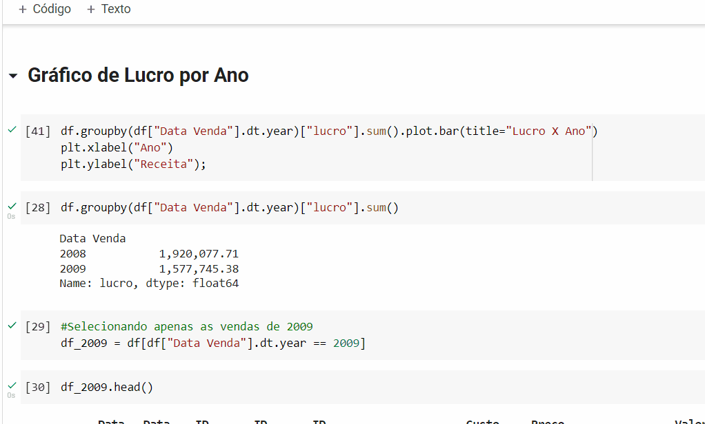

## Análise de Dados com Python e Pandas

### Desafio de projeto realizado no bootcamp Geração Tech da Unimed-BH

Neste desafio foram feitas algumas análise como:
análise de planilhas do Excel e análise exploratória.

### Bibliotecas utilizadas

- Pandas
- matplotlib
- seaborn

### Uma das formas de rodar o projeto

- Ter uma conta no Google colab e fazer o upload dos arquivos.
